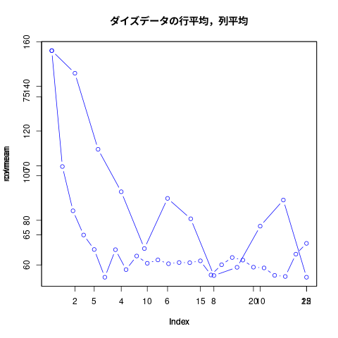

# [生物統計学１](http://lbm.ab.a.u-tokyo.ac.jp/~omori/noko/distribution.html)

## 要約統計量

    ## 
    #英語の得点の記述統計

    ## 
    #英語の得点の記述統計
    
    eigo <- c(	
    36,70,56,68,76,60,50,63,62,42,64,60,50,68,71,67,	
    50,65,67,57,72,64,61,66,46,80,46,51,59,32,55,65,	
    65,52,57,64,23,57,53,54,38,71,57,69,77,61,51,64,	
    63,43,65,61,51,69,72,68,53,66,68,58,73,65,62,67,	
    47,81,47,52,59,33,56,66,67,52,58,65,24,58,54,55)
    
    length(eigo)	     	#データ数　
    mean(eigo)	     	# 標本平均　
    var(eigo)	     	# 標本分散　
    sd(eigo)	     	# 標本標準偏差　
    
    summary(eigo)		# データの要約統計量

    [1] 80
    [1] 58.625
    [1] 134.3892
    [1] 11.59264
       Min. 1st Qu.  Median    Mean 3rd Qu.    Max. 
      23.00   52.00   60.50   58.62   66.25   81.00

## データの図示

    ##
    ## データの図示
    
    ## 箱ヒゲ図
    ## png(file="bio/graph/eigo-box.png")
    boxplot(eigo, main="英語得点の箱ヒゲ図") #箱ひげ図
    boxplot.stats(eigo)	     	         #箱ひげ図用統計量　

    ## 英語のヒストグラム
    ## png("bio/graph/eigo-hist.png")
    hist(eigo, breaks=seq(0, 100, by=5), xlab="英語得点", ylab="頻度", main="")
    title(main = "英語得点のヒストグラム")	   #グラフタイトル
    stem(eigo, scale=2)	     	           #幹葉表示

### ダイズ地上部乾物重データ

   ダイズの植物体に圃場環境の不均一性がどのように現れるかの実験
    1971年に、長野県塩尻市 にある中信試験場（現在は，長野県野菜・花卉試験
場）で実施された。一枚の圃場（南北約 8m、東西約 18m）で、畝は南北に作
り、畝間は約75cm、株間は約15cmの間隔に作られた植穴に2粒ずつ播種し、間
引きと補植で1本仕立てにした。各個体は、根際で切断され、地上部を乾燥し
た後、

地上部全重(g)、粒重(g)、主茎長(cm)、分枝数(本)の4形質が測定された。

今回使用するデータは、その北西部分にあたる12畝、25株の地上部全重デー
タをそれらの位置に対応して並べたものである。すなわち、データ行 列
の左側と上側は道路に面しているが、右側と下側は他のダイズ個体に面し
ていた。

データダウンロード <./bio/data/daizu.csv>

    ##
    ##ダイズデータ読み込み
    daizu.df <- read.csv("bio/data/daizu.csv")     # daizu.csv ファイル読み込み
    dim(daizu.df)                # データの大きさ
    head(daizu.df)               # 最初の一部の行のみを表示

    [1] 25 12
      ridge1 ridge2 ridge3 ridge4 ridge5 ridge6 ridge7 ridge8 ridge9 ridge10
    1    176    171    173    194     NA    130    168    143    100     167
    2    119     75     83    154    140    125     99    106    109      85
    3    101    107     69     77    103    107     76     70     73      74
    4     77     90    103     46     85     62     75     83     68      68
    5     75     81     69     75     44     59     51     76     58      84
    6     77     70     62     10     40     58     66     28     62      71
      ridge11 ridge12
    1     160     134
    2     110      44
    3      84      70
    4      53      71
    5      58      73
    6      62      48

    ##
    ## daizu.dfはdata.frameなので行列に変換する。
    
    daizu.mat <- as.matrix(daizu.df)
         
    # その後ベクトル化して1次元数値データにする。
    daizu <- as.vector(daizu.mat)
    length(daizu)
    summary(daizu)
    
    ## データに欠測値、NA(Not Avairable) が含まれていると計算してくれないので、
    ## NA部分を除く(remove)という命令、na.rm=Tを付け加える必要がある。
    
    mean(daizu)
    mean(daizu, na.rm=T)
    sd(daizu, na.rm=T)

    [1] 300
       Min. 1st Qu.  Median    Mean 3rd Qu.    Max.    NA's 
       1.00   54.00   65.00   67.68   75.00  194.00       2
    [1] NA
    [1] 67.68121
    [1] 26.1403

    
    ##
    ## ダイズデータをグラフにする。
    boxplot(daizu)
    title(main="ダイズデータの箱ひげ図")

    ##
    ##ダイズデータをグラフにする。
    hist(daizu, breaks=seq(0, 200, by=5), main="ダイズデータの頻度表")

ダイズデータの行平均や列平均を求る。

-   これは、apply()関数を用いる。
    -   mean の他に max, sum, sd, など色々な操作もできる。
    -   na.rm=T も忘れずに入れる。

    ##
    ##
    rowmean <- apply(daizu.df, 1, mean, na.rm=T); rowmean		# 行平均
    colmean <- apply(daizu.df, 2, mean, na.rm=T); colmean		# 列平均

     [1] 156.00000 104.08333  84.25000  73.41667  66.91667  54.50000  66.83333
     [8]  57.91667  64.00000  60.75000  62.25000  60.54545  61.08333  61.00000
    [15]  61.83333  55.50000  60.08333  63.33333  62.16667  59.00000  58.66667
    [22]  55.33333  54.83333  64.83333  69.66667
     ridge1  ridge2  ridge3  ridge4  ridge5  ridge6  ridge7  ridge8  ridge9 ridge10 
     78.360  76.720  71.200  68.120  64.000  67.640  66.160  62.040  62.640  65.625 
    ridge11 ridge12 
     67.520  61.920

    ##
    ##
    plot(rowmean, type="b", col="blue", main="ダイズデータの行平均，列平均")
    par(new=T)
    plot(colmean, type="b", col="blue")

　左側ほど値が大きい、理由は後ほど考える。 

