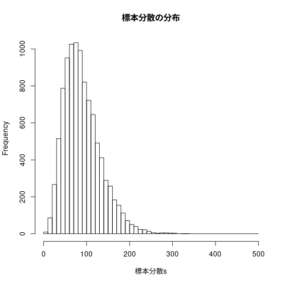

# 標本分布 (<http://wiki.cis.iwate-u.ac.jp/~suzuki/RforS/org/RforS-II-04.html> より抜粋)


### 正規母集団

```{r}
    ##
    ## 正規分布のグラフを描く
    ##
    
    curve(dnorm(x), from=-4, to=4, main="図4.4-5 正規分布 N(0, 1), N(0,2), N(1,1)")        # 標準正規分布のグラフ， -4 から +4 の範囲
    curve(dnorm(x,sd=2), add=TRUE)        # 平均0， 偏差2 の正規分布，上描き 
    curve(dnorm(x,mean=1,sd=1), add=TRUE) # 平均1， 偏差1 の正規分布，上描き 
```

### 正規母集団から単純無作為抽出を行なう

**Rを使って正規分布の母集団から標本を抽出する方法**

例えば、平均50、標準偏差10の正規母集団からn＝5の標本を無作為抽出
する

```{r}
    ##
    ## 平均50、標準偏差10の正規母集団からn＝5の標本を無作為抽出する
    ##
    
    rnorm(n=5, mean=50, sd=10)       # 標本の抽出
    hist(rnorm(n=5, mean=50, sd=10), main="図4.7 N(50, 10)からの n=5 の標本の頻度表") # 頻度表の描画
```

```{r}
    ##
    ## 平均50、標準偏差10の正規母集団からn＝1000の標本を無作為抽出する
    
    hist(rnorm(n=1000, mean=50, sd=10), main="図4.8 N(50, 10)からの n=1000 の標本の頻度表")

```{r}

##### 図 3.8 N(50,10)からの n=1000 の標本の頻度表


### 標本分布

-   **標本分布:** 標本統計量の確率分布のこと
    -   推定値の信頼性の判断に用いる
    
    -   標本における個々のデータの実現値を表した度数分布ではなく、
    
    -   標本統計量の確率分布である


#### 標本分布から何が分るのか

（1）標本分布が母数の本当の値を中心として分布しているか
（2）標本分布が横に大きく広がっていないか


##### 標本分布を経験的に求める

標本分布は次のものから数学的に求まる:

1.  母集団分布
2.  標本統計量の計算式 (変数変換)
3.  標本数

Rを用いて，理論的ではなく，経験的の標本分布を求めることができる

標本統計量の実現値を大量に得られれば，そのヒストグラムは，標本分
布近いものとなるはず。

-   サイズ $ n $ の標本を何度も繰かえし抽出し，実現量を計算し，ヒス
    トグラムを作成する

しかし，母集団分布が母数を含めてわかっていないため，

-   「もし母集団分布がこのような正規分布だったら、

-   このくらいあてになる推定値が得られる」

ということを検討することになる。


### 正規母集団の母平均の推定

-   母集団分布 $ \sim N(50, 10^2)$
-   $ n = 10 $
-   母平均の推定量は，標本平均 $ \overline{X} $

```{r}
    ##
    ## 標本サイズ10の標本による，母平均の推定
    
    標本 <- rnorm(n=10, mean=50, sd=10)
    mean(標本)
```


#### 標本平均の標本分布を求める

母平均の推定を10000回繰り返し

```{r}
    ##
    ## 母平均の推定
    ### 母集団 N(50, 10^2) から
    ### 標本サイズ 10の標本の標本平均
    ### 10000個の標本平均の頻度表を描く
    this.mean <- 50
    this.sd <- 10
    this.counts <- 10000
    
    for (this.sample_size in c(10,20,40,80,160)) {
      標本平均 <- numeric(length=this.counts) 
          
      for(i in 1:this.counts) {
    1
        標本 <- rnorm(n=this.sample_size, mean=this.mean, sd=this.sd)
        標本平均[i] <- mean(標本)
      }
      cat("sample_size=", this.sample_size,
          "mean=", mean(標本平均),
          "var=", var(標本平均),
          "\n")
    }

    sample_size= 10 mean= 49.96241 var= 10.05521 
    sample_size= 20 mean= 50.0166 var= 4.972701 
    sample_size= 40 mean= 50.00013 var= 2.492854 
    sample_size= 80 mean= 49.98691 var= 1.258187 
    sample_size= 160 mean= 50.0009 var= 0.6234049
    hist(標本平均,main="図4.12 標本抽出10,000回のときの標本平均の分布")
```


###### 図4.12 標本抽出10,000回のときの標本平均の分布


```{r}
    ##
    ## 10000個の標本平均の平均値
    
    mean(標本平均)
    
    ## 10000個の標本平均の分散値
    
    var(標本平均)

    [1] 50.00111
    [1] 0.6388567

    ##
    # png("graphs/fig-04-13.png", width=400, height=300)
    ##
    hist(標本平均,freq=FALSE, main="図4.13 標本平均の標本分布")
    curve(dnorm(x, mean=this.mean, sd=this.sd/sqrt(this.sample_size)), add=TRUE, col="red")

```
-   図4.13 標本平均の標本分布


#### 4.5.5 不偏性

推定値 (e.g. 標本平均) の平均 (e.g. 標本分布の平均) は
母集団分布によらず，
母数 (e.g. 母平均) に一致すること

標本平均は，母平均の不偏推定量である。


#### 4.5.6 標準誤差

推定量の標本分布を調べるときの2つの観点のうち「（2）標本分布が横
に大きく広がっていないか」にかかわるのが標準誤差です。

標準誤差は、推定量の標本分布の標準偏差と定義する

標準誤差が小さいということ

-   運不運によって結果が大きく左右されない
-   また、誰がいつやってもだいたい同じ結果が安定
    して得られる

上の $ N(50,10^2) $の正規母集団から $ n=10 $ の標本を抽出した
ときの標本平均の例では、

-   標本平均の標本分布はN(50,10)だったので，
-   標準誤差は $ \sqrt{10} $ となります。

一般的に、

-   母集団が，平均 $ \mu $、分散$ \sigma^2 $ の正規分布で
-   標本サイズ $ n $ の標本を抽出したとき、
-   その標本平均の標本分布は $ N(\mu, \frac{\sigma^2}{n}) $となる
-   標準誤差は $ \frac{\sigma}{\sqrt{n}} $ となる。

このことから、

1.  母集団分布の分散（標準偏差）が大きいほど、標本平均の標準誤差が
    大きくなる。つまり、母分散が大きいと、そこから無作為抽出した標
    本の平均値は母平均から外れた値をとりやすくなる。

2.  標本サイズが大きいほど、標本平均の標準誤差が小さくなる。つ
    まり、標本サイズを大きくすれば、そこから無作為抽出した標本
    の平均値は母平均に近い値をとりやすくなる

実際に、先ほどの$ N(50,10^2) $ という母集団からの標本抽出の例で、標本サ
イズを10倍の $ n=100 $ にしてみると


```{r}
    this.sample_size <- 100
    標本平均 <- numeric(length=this.counts)
          
    for(i in 1:this.counts) {
      標本 <- rnorm(n=this.sample_size, mean=this.mean, sd=this.sd)
      標本平均[i] <- mean(標本)
    }
    
    mean(標本平均) ## 付加
    var(標本平均)
    
    誤差絶対値5以下 <- ifelse( abs(標本平均-50) <= 5, 1, 0) ## 付加
    table(誤差絶対値5以下) ## 付加

    [1] 50.01843
    [1] 1.013532
    誤差絶対値5以下
        1 
    10000

    ##
    ## png(RforS-graphs/04-14.png)
    
    hist(標本平均,freq=FALSE, main="図4.14 標本サイズを大きくしたときの標本平均の標本分布")
    curve(dnorm(x,mean=50,sd=this.sd/sqrt(this.sample_size)),col="red",add=TRUE)
    curve(dnorm(x,mean=50,sd=this.sd/sqrt(10)),col="blue",add=TRUE)
```

###### 図4.14 標本サイズを大きくしたときの標本平均の標本分布


### 4.6 標本分散と不偏分散の標本分布

-   不偏分散は，母分散の不偏推定量
-   標本分散は，標本の散布度
    
```{r}
        ##
        ## 4.6 標本分散と不偏分散の標本分布
        ##
        
        samples.no <- 10000   # いくつ標本を用いるか
        sample.size <- 10     # ひとつの標本の中のデータの個数
        
        this.mean <- 50       # 分布の平均
        this.sd <- 10         # 分布の標準偏差
        
        標本分散s <- numeric(samples.no) # 各々の標本の分散値の保存場所
        不偏分散s <- numeric(samples.no) # 各々の標本の不偏分散値の保存場所
        
        for (i in 1:samples.no) {
          標本 <- rnorm(n=sample.size, mean=this.mean, sd=this.sd) # ひとつの標本の生成
          標本分散s[i] <- mean((標本-mean(標本))^2) 
          不偏分散s[i] <- var(標本)
        }
        
        c(mean(標本分散s),sd(標本分散s))  # 標本分散達の平均と分散
        c(mean(不偏分散s),sd(不偏分散s))  # 標本不偏分散達の平均と分散

    [1] 90.08901 42.72613
    [1] 100.09890  47.47348

    ##
    ## 標本分散の頻度表
    ##
    hist(標本分散s, breaks=seq(0,500,10), main="標本分散の分布")

    ##
    ## 標本不偏分散の頻度表
    ##
    hist(不偏分散s, breaks=seq(0,500,10), main="不偏分散の分布")
```

#### 図4.15 標本分散と不偏分散の分布

 

```{r}
    ##
    ## 標本分散の分布
    ##
    hist(標本分散s/100*10, freq=FALSE, breaks=seq(0,50,1), main="標本分散/母分散の分布と自由度9のカイ二乗分布")
    curve(dchisq(x,9), add=TRUE, col="red")

    ##
    ## 標本不偏分散の分布
    ##
    hist((不偏分散s/100)*9, freq=FALSE, breaks=seq(0,50,1), main="不偏分散/母分散の分布と自由度9のカイ二乗分布")
    curve(dchisq(x,9), add=TRUE, col="red")
```

